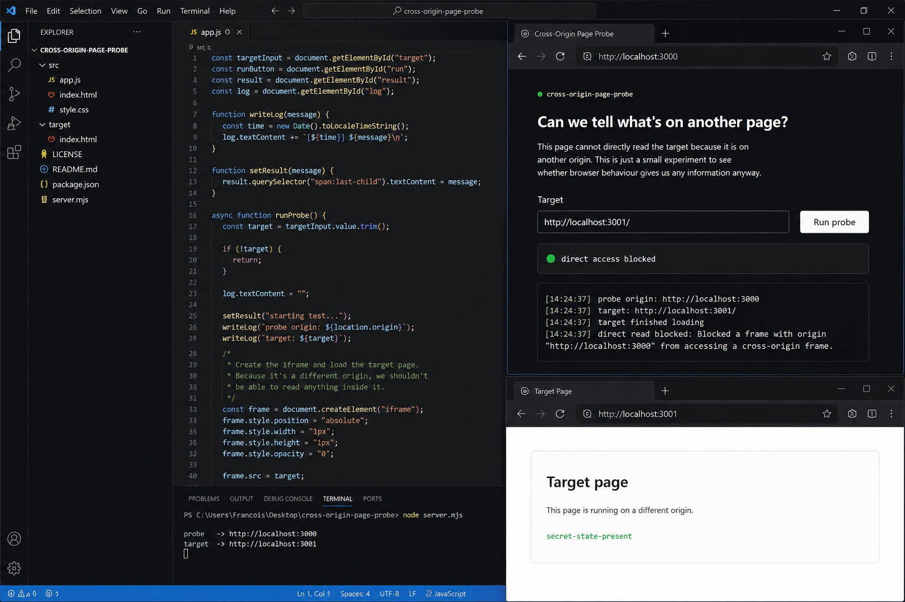

# Cross-Origin Page Probe

A little POC for figuring out stuff about a cross-origin page without being able to directly read it.

I was messing around with browser security and ended up wondering:

> **Can a website figure out something about another website without actually being allowed to read it?**

So this repo is basically me testing that.

## What it looks like



## What this is

The basic idea is to have one page try to learn something about another page that lives on a different origin.

Normally, the browser's same-origin policy stops you from doing something like:

```js
fetch("https://example.com")
